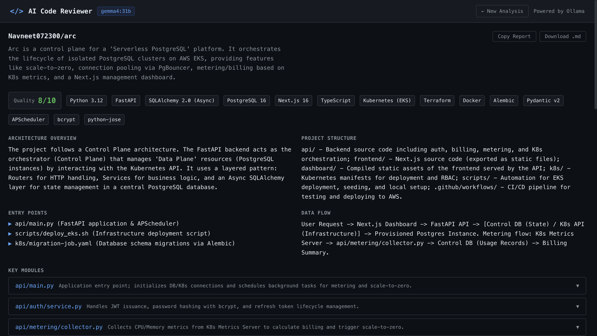

<div align="center">

# `</>` AI Code Reviewer

**An AI-powered tool that reads, explains, debugs, and reviews your code — paste a snippet or drop a GitHub repo URL and get a full architectural analysis in seconds.**

[](https://fastapi.tiangolo.com)
[](https://nextjs.org)
[](https://www.typescriptlang.org)
[](https://ollama.com)
[](https://python.org)
[](LICENSE)

</div>

---



---

## Features

| Feature | Description |
|---|---|
| **Code Analysis** | Paste any code snippet — get a full breakdown: summary, execution flow, bugs, fixes, complexity |
| **GitHub Repo Analysis** | Drop a repo URL and get a full architectural review of the entire codebase |
| **GitHub File Fetch** | Paste a file, PR diff, or Gist URL — it loads directly into the editor |
| **Streaming Responses** | Results stream in token-by-token, no waiting for the full response |
| **Unit Test Generator** | Auto-generate tests with the right framework for your language |
| **Documentation Generator** | Produces docstrings + README-ready documentation |
| **Security Scanner** | OWASP-focused vulnerability findings with remediation steps |
| **Language Converter** | Translate code between 15+ languages |
| **Architecture Diagrams** | Mermaid.js diagrams of your codebase structure |
| **Interview Questions** | Generates questions (beginner → advanced) from your code |
| **Commit Message Generator** | Conventional commit messages from git diffs |
| **Download Report** | Export the full analysis as a Markdown file |
| **Dark-first UI** | Developer-tool aesthetic with Monaco editor |

---

## Stack

```
┌─────────────────────────────────────────────────────────────┐
│  Frontend                                                    │
│  Next.js 14 (App Router) · TypeScript · Tailwind CSS        │
│  Monaco Editor · Mermaid.js · react-markdown                │
├─────────────────────────────────────────────────────────────┤
│  Backend                                                     │
│  FastAPI · Python 3.12 · Pydantic v2 · slowapi              │
│  httpx (async HTTP) · python-dotenv                         │
├─────────────────────────────────────────────────────────────┤
│  AI                                                          │
│  Ollama REST API · gemma4:31b (128K context)                │
│  Configurable via OLLAMA_URL + OLLAMA_MODEL env vars        │
└─────────────────────────────────────────────────────────────┘
```

---

## Prerequisites

- **Python 3.11+** (3.12 recommended)
- **Node.js 18+**
- **An Ollama instance** — local (`http://localhost:11434`) or remote (RunPod, etc.)
- A model pulled in Ollama, e.g. `ollama pull gemma4:31b`

---

## Setup

### 1. Clone

```bash
git clone https://github.com/your-username/code-reviewer.git
cd code-reviewer
```

### 2. Backend

```bash
cd backend

# Create and activate a virtual environment
python3 -m venv .venv
source .venv/bin/activate        # Windows: .venv\Scripts\activate

# Install dependencies
pip install -r requirements.txt

# Configure environment
cp .env.example .env
# Edit .env — set OLLAMA_URL and OLLAMA_MODEL

# Start the API server
uvicorn app.main:app --reload --port 8000
```

Backend runs at → **http://localhost:8000**  
Interactive API docs → **http://localhost:8000/docs**

### 3. Frontend

```bash
cd frontend

# Install dependencies
npm install

# Configure environment (already set by default for local backend)
# Edit .env.local if your backend is on a different port/host

# Start the dev server
npm run dev
```

Frontend runs at → **http://localhost:3000**

---

## Environment Variables

### `backend/.env`

```env
# Required — your Ollama instance
OLLAMA_URL=http://localhost:11434
OLLAMA_MODEL=gemma4:31b

# Optional — GitHub personal access token
# Needed for private repos and to avoid rate limits (60 req/hr → 5000 req/hr)
GITHUB_TOKEN=ghp_...
```

### `frontend/.env.local`

```env
NEXT_PUBLIC_API_URL=http://localhost:8000
```

---

## Usage

### Paste code and analyze

1. Open **http://localhost:3000**
2. Paste or type code in the Monaco editor
3. Choose a language (or let it auto-detect) and a mode:
   - **Beginner** — plain-English explanations, no jargon
   - **Full Review** — complete analysis for all levels
   - **Senior** — concise, focuses on edge cases and advanced optimisations
4. Click **Analyze** — results stream in on the right

### Analyse a full GitHub repository

1. Paste a repo URL in the GitHub bar: `github.com/user/repo`
2. Click **Analyze Repo**
3. The app fetches up to 35 source files, bundles them, and streams a full architectural review

### Fetch a specific file or PR

Supported URL formats:

```
github.com/user/repo/blob/main/path/to/file.py   →  loads file into editor
github.com/user/repo/pull/123                     →  loads PR diff
gist.github.com/user/HASH                         →  loads gist
raw.githubusercontent.com/...                     →  used directly
```

---

## API Reference

| Method | Endpoint | Body | Description |
|--------|----------|------|-------------|
| `POST` | `/api/analyze` | `{code, language?, mode?}` | Full analysis — **streaming** |
| `POST` | `/api/analyze-repo` | `{url}` | Full repo analysis — **streaming** |
| `POST` | `/api/generate-tests` | `{code, language?}` | Generate unit tests |
| `POST` | `/api/generate-docs` | `{code, language?}` | Generate documentation |
| `POST` | `/api/convert-language` | `{code, source_lang, target_lang}` | Translate code |
| `POST` | `/api/architecture-diagram` | `{code, language?}` | Mermaid diagram |
| `POST` | `/api/security-scan` | `{code, language?}` | OWASP security scan |
| `POST` | `/api/interview-questions` | `{code, language?}` | Interview questions |
| `POST` | `/api/commit-message` | `{diff}` | Conventional commit message |
| `POST` | `/api/fetch-github` | `{url}` | Fetch file/PR/gist content |
| `POST` | `/api/github-tree` | `{url}` | List repo files |
| `GET`  | `/health` | — | Health check |

---

## Project Structure

```
code-reviewer/
├── backend/
│   ├── app/
│   │   ├── main.py              # FastAPI app, CORS, rate limiting
│   │   ├── prompts/
│   │   │   ├── system_prompt.py # Code analysis system prompt
│   │   │   └── repo_prompt.py   # Repo analysis system prompt
│   │   ├── routers/
│   │   │   ├── analyze.py       # /api/analyze (streaming)
│   │   │   ├── extras.py        # All other endpoints
│   │   │   └── github.py        # GitHub fetch + repo analysis
│   │   ├── schemas/
│   │   │   └── requests.py      # Pydantic request models
│   │   └── services/
│   │       └── claude.py        # Ollama LLM service layer
│   ├── requirements.txt
│   └── .env.example
│
├── frontend/
│   └── src/
│       ├── app/
│       │   ├── page.tsx         # Main page — all state lives here
│       │   └── layout.tsx
│       ├── components/
│       │   ├── editor/
│       │   │   ├── CodeEditor.tsx     # Monaco editor wrapper
│       │   │   └── GithubInput.tsx    # GitHub URL bar
│       │   ├── results/
│       │   │   ├── ResultTabs.tsx     # Single-file analysis tabs
│       │   │   ├── RepoResultsPanel.tsx # Repo analysis panel
│       │   │   ├── MermaidDiagram.tsx
│       │   │   └── MarkdownBlock.tsx
│       │   └── ui/
│       │       ├── Spinner.tsx
│       │       ├── CopyButton.tsx
│       │       └── DownloadButton.tsx
│       ├── lib/
│       │   └── api.ts           # All API calls
│       └── types/
│           └── index.ts         # Shared TypeScript types
│
├── screenshot.png
└── README.md
```

---

## Rate Limits

- **`/api/analyze`** and **`/api/analyze-repo`**: 10 requests / minute per IP
- All other endpoints: 20 requests / minute per IP

---

## Switching the AI Model

Any model available in your Ollama instance works. Edit `backend/.env`:

```env
OLLAMA_MODEL=llama3.2
OLLAMA_MODEL=qwen2.5-coder:32b
OLLAMA_MODEL=deepseek-r1:14b
```

Restart the backend after changing.

---

## License

MIT — feel free to use, modify, and distribute.
